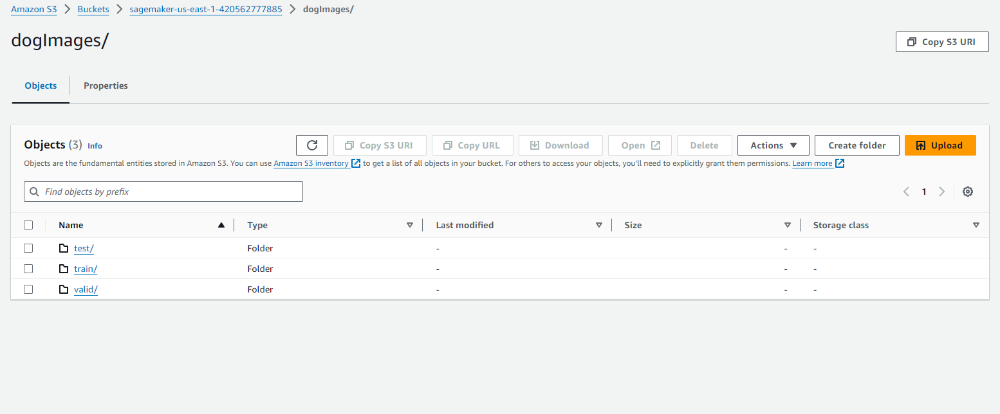
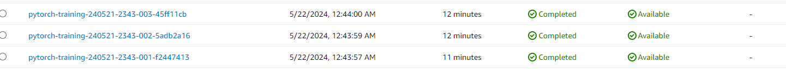
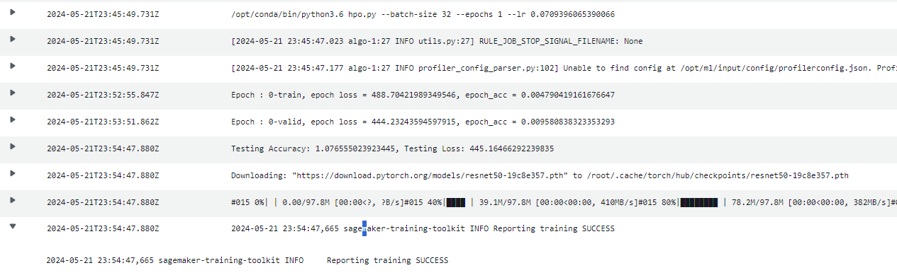
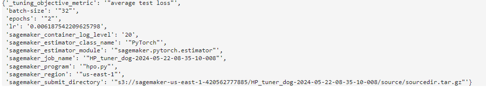
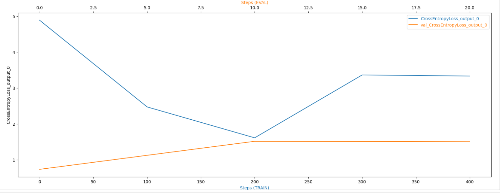
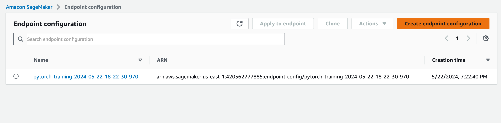

# Image Classification using AWS SageMaker

Use AWS Sagemaker to train a pretrained model that can perform image classification by using the Sagemaker profiling, debugger, hyperparameter tuning and other good ML engineering practices. This can be done on either the provided dog breed classication data set or one of your choice.

## Project Set Up and Installation
Enter AWS through the gateway in the course and open SageMaker Studio. 
Download the starter files.
Download/Make the dataset available. 

## Dataset
The provided dataset is the dogbreed classification dataset which can be found in the classroom.
The project is designed to be dataset independent so if there is a dataset that is more interesting or relevant to your work, you are welcome to use it to complete the project.

### Access
Upload the data to an S3 bucket through the AWS Gateway so that SageMaker has access to the data [Data Bucket in S3]. 

## Hyperparameter Tuning
What kind of model did you choose for this experiment and why? Give an overview of the types of parameters and their ranges used for the hyperparameter search
In my experiments i have used resnet50 model for image classification task of different dog breeds, i set the continuos learning rate between 0.001-0.1 for the hyper paramter tuning,  the batch size was set to 32,64 and 128, similarly epochs were set to 1,2 , all the successfull trainings jobs with the log metrics are shown below 

Remember that your README should:
- Include a screenshot of completed training jobs
- Logs metrics during the training process
- Tune at least two hyperparameters
- Retrieve the best best hyperparameters from all your training jobs

## Debugging and Profiling
**TODO**: Give an overview of how you performed model debugging and profiling in Sagemaker
### Debugging
Using smdebug library debugging was done as it assists with hooks which helps to capture tensors value at different stages of training, usign this helps to know about the score of training jobs, this library is used to also check for anamolies in training job. Using cloud watch helped to check where different errors were coming in code
### Profiling 
This was done using sagemaker profiler function as it helps us to create html report which helped us to check the overall performance 

### Results
**TODO**: What are the results/insights did you get by profiling/debugging your model?

**TODO** Remember to provide the profiler html/pdf file in your submission.

## Model Deployment
**TODO**: Give an overview of the deployed model and instructions on how to query the endpoint with a sample input.
Model deployed uses Pytorch Convolutional Neural Network which is based on resnet50, this is then used for tuning which has the predictor function on its one end which can then be used for predicting on the dog images provided

## Standout Suggestions
**TODO (Optional):** This is where you can provide information about any standout suggestions that you have attempted.
