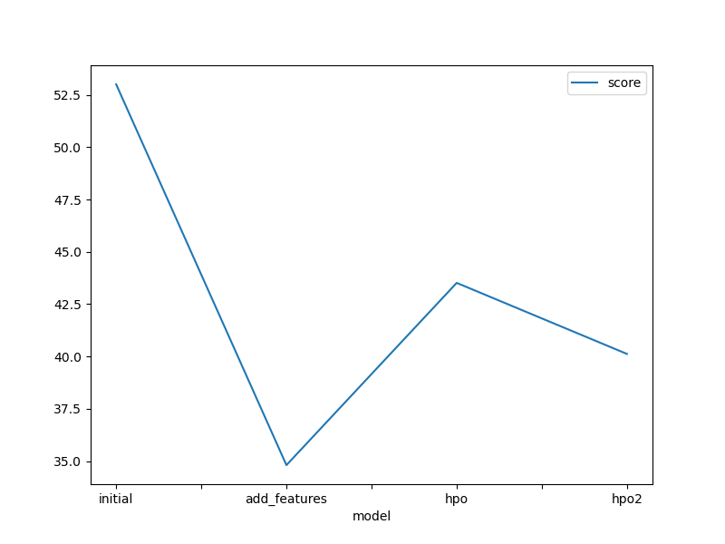
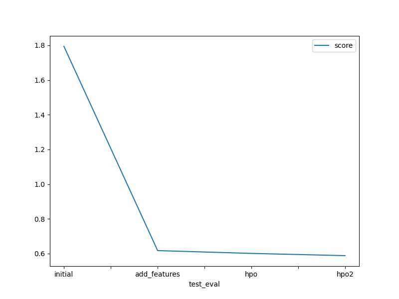

# Report: Predict Bike Sharing Demand with AutoGluon Solution
MUHAMMAD UMAR FARRUKH

## Initial Training
### What did you realize when you tried to submit your predictions? What changes were needed to the output of the predictor to submit your results?
All the predictions need to having value more than zero as it is Kaggles criteria that it will reject submissions with values in negative so all the values less than zero were converted to zero using loop, this was my first submission to kaggle using CLI so the learnings aboout converting them too zero before zero was helpful, in iteration 2 you can see two of my submissions have errors in them where negative values in predictions were submitted so it was rejected by kaggle so cconverting them to zero helped to submit it succewssfully 

### What was the top ranked model that performed?
Top Ranked model had score of 0.58 which is the last one, in this last iteration i checked for correlation among features and found weather to be correlated with humidity along with season correlated with month so i one hot encooded these features, similarly in hyper paramters reducing number of leaves and increasing number of epochs increased the efficency

## Exploratory data analysis and feature creation
### What did the exploratory analysis find and how did you add additional features?
In EDA i found some features did not had the correct data type such as weather and season, so there data type was corrected along with datetime feature converted into datetime using pandas function, also the date time original feature was dropped and new feature of day, month, year and hour were created

### How much better did your model preform after adding additional features and why do you think that is?
Having more nominal features and correct data types increased the perfoormance of model as features with incorrect data type can be inferred incorrectly by the model 

## Hyper parameter tuning
### How much better did your model preform after trying different hyper parameters?
the root mean squared error for the model decreased which improved the score for kaggle submission , having more tuning of hyper paramters can help increase score of submission

### If you were given more time with this dataset, where do you think you would spend more time?
i would have implemented time series modelling along with more tuning of the hyper paramters as there is a range of hyper pramters associated for time series which can be used and that can imrprove the learning 

### Create a table with the models you ran, the hyperparameters modified, and the kaggle score.
|model|hpo1|hpo2|hpo3|score|
|--|--|--|--|--|
|initial|53.012271|53.012271|43.518283|1.79413|
|add_features|34.804929|34.804929|34.804929|0.61719|
|hpo|43.518283|43.518283|43.518283|0.60101|
|hpo2|40.121809|40.266762|41.335800|0.58809|

### Create a line plot showing the top model score for the three (or more) training runs during the project.

### Create a line plot showing the top kaggle score for the three (or more) prediction submissions during the project.

## Summary
This project helped me to learn about the usability of AutoGluon library. It helped me to learn about the stability and efficency of aws autogloun library which tries to predict the best possible ML algorthims without much hinderence, i have only used ml.t3 medium instance throughout whereas if i was implementing it normal circumstances i would have required a higher upgraded instance, all the submissions i have maded were linked with kaggle project bike sharing demand , all the submission values were first checcked for negative values and in case if there were any they replaced with zero values, as kaggle rejects all the submissions with negative values. In initial stage i just implemented autogloun with the instructed hyper parameters without doing any feature engineering which resulted in kagggle score of 1.7-1.8 with quite high Root mean square error, in second iteration feature engineering on datetime feature was done after correcting its data type and generated four features day,hour,year,month, along with that weather and season was changed to category data type as well. This improved the submission score 0.61 and with low rmse, in the third and fourth ieration more features were generated after checking correlations and having more hyper parameters which results in improving the score upto 0.58. In this excercise if i was given more time i could have implemeted time series modelling along with generating more time series plots and features 
